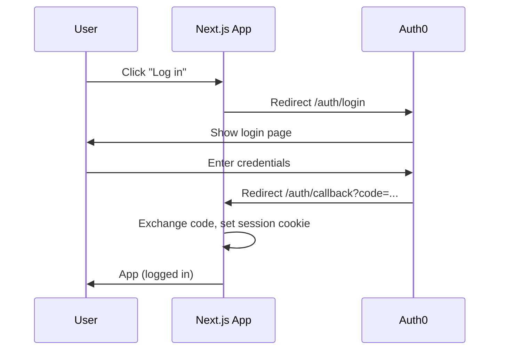
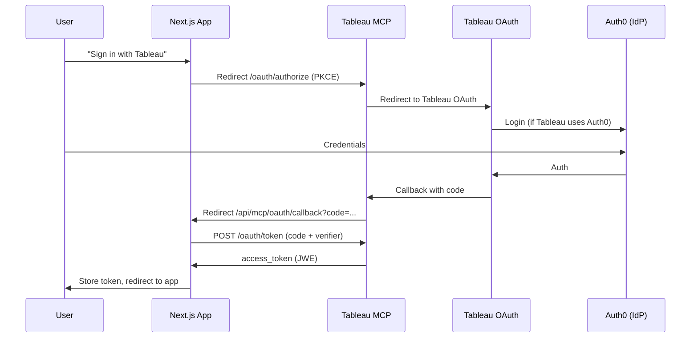
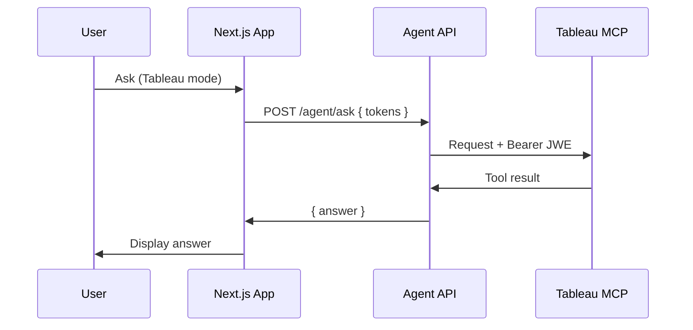

# Authentication Flow Diagram

## Mermaid Diagrams

### App Login (Auth0)



### Tableau MCP OAuth (MCP → Tableau → Auth0)



### Agent Request with Token



---

## ASCII Diagrams

### 1. App Login (Auth0)

```
┌─────────┐     ┌─────────────┐     ┌─────────┐     ┌─────────────┐     ┌─────────┐
│  User   │     │  Next.js     │     │  Auth0  │     │  Auth0      │     │  User   │
│         │     │  App         │     │  Login  │     │  Callback   │     │         │
└────┬────┘     └──────┬──────┘     └────┬────┘     └──────┬──────┘     └────┬────┘
     │                 │                 │                 │                 │
     │  Click "Log in"  │                 │                 │                 │
     │────────────────>│                 │                 │                 │
     │                 │  Redirect to    │                 │                 │
     │                 │  /auth/login    │                 │                 │
     │                 │────────────────>│                 │                 │
     │                 │                 │                 │                 │
     │                 │  Auth0 login    │                 │                 │
     │                 │  page          │                 │                 │
     │<────────────────│<────────────────│                 │                 │
     │                 │                 │                 │                 │
     │  Enter credentials               │                 │                 │
     │─────────────────────────────────>│                 │                 │
     │                 │                 │                 │                 │
     │                 │  Redirect to    │                 │                 │
     │                 │  /auth/callback │                 │                 │
     │                 │<────────────────│                 │                 │
     │                 │                 │                 │                 │
     │                 │  Set session    │                 │                 │
     │                 │  cookie         │                 │                 │
     │                 │                 │                 │                 │
     │  App (logged in)                 │                 │                 │
     │<────────────────│                 │                 │                 │
     │                 │                 │                 │                 │
```

### 2. Tableau MCP Connection (MCP OAuth → Tableau → Auth0)

When the user clicks "Sign in with Tableau" for an OAuth-protected MCP server:

```
┌─────────┐   ┌─────────────┐   ┌─────────────┐   ┌─────────────┐   ┌─────────┐
│  User   │   │  Next.js    │   │  Tableau    │   │  Tableau    │   │  Auth0  │
│         │   │  App        │   │  MCP Server │   │  OAuth      │   │ (IdP)   │
└────┬────┘   └──────┬──────┘   └──────┬──────┘   └──────┬──────┘   └────┬────┘
     │               │                 │                 │               │
     │ "Sign in with  │                 │                 │               │
     │  Tableau"     │                 │                 │               │
     │──────────────>│                 │                 │               │
     │               │                 │                 │               │
     │               │  Redirect to    │                 │               │
     │               │  /api/mcp/oauth/connect?serverId=X │               │
     │               │────────────────>                 │               │
     │               │                 │                 │               │
     │               │  Redirect to    │                 │               │
     │               │  MCP /oauth/authorize             │               │
     │               │  (PKCE)         │                 │               │
     │               │────────────────>                 │               │
     │               │                 │                 │               │
     │               │  Redirect to    │                 │               │
     │               │  Tableau OAuth  │                 │               │
     │               │                 │────────────────>│               │
     │               │                 │                 │               │
     │               │                 │  Tableau login   │               │
     │               │                 │  (Auth0 if      │               │
     │               │                 │  configured)    │               │
     │               │                 │                 │──────────────>│
     │               │                 │                 │               │
     │<──────────────────────────────────────────────────────────────────│
     │  User signs in via Auth0 (if Tableau uses Auth0)                   │
     │               │                 │                 │<───────────────│
     │               │                 │                 │               │
     │               │                 │  Tableau auth   │               │
     │               │                 │  code            │               │
     │               │                 │<────────────────│               │
     │               │                 │                 │               │
     │               │  MCP callback   │                 │               │
     │               │  with MCP code  │                 │               │
     │               │<────────────────│                 │               │
     │               │                 │                 │               │
     │               │  Redirect to    │                 │               │
     │               │  /api/mcp/oauth/callback?code=...  │               │
     │               │<────────────────                  │               │
     │               │                 │                 │               │
     │               │  POST /oauth/token                 │               │
     │               │  (exchange code)│                 │               │
     │               │────────────────>│                 │               │
     │               │                 │                 │               │
     │               │  access_token    │                 │               │
     │               │  (JWE)           │                 │               │
     │               │<────────────────│                 │               │
     │               │                 │                 │               │
     │               │  HTML + script:  │                 │               │
     │               │  store token in │                 │               │
     │               │  localStorage,   │                 │               │
     │               │  redirect to /   │                 │               │
     │               │                 │                 │               │
     │  App with     │                 │                 │               │
     │  MCP connected│                 │                 │               │
     │<──────────────│                 │                 │               │
     │               │                 │                 │               │
```

### 3. Agent Request (with stored token)

```
┌─────────┐   ┌─────────────┐   ┌─────────────┐   ┌─────────────┐
│  User   │   │  Next.js    │   │  Agent API  │   │  Tableau    │
│         │   │  App        │   │  (Python)   │   │  MCP Server │
└────┬────┘   └──────┬──────┘   └──────┬──────┘   └──────┬──────┘
     │               │                 │                 │
     │  Ask question │                 │                 │
     │  (Tableau mode)                 │                 │
     │──────────────>│                 │                 │
     │               │                 │                 │
     │               │  POST /api/agent/ask              │
     │               │  { question, connectedServers,    │
     │               │    tokens: { serverId: JWE } }   │
     │               │────────────────>                 │
     │               │                 │                 │
     │               │                 │  MCP request   │
     │               │                 │  Authorization: │
     │               │                 │  Bearer <JWE>   │
     │               │                 │────────────────>│
     │               │                 │                 │
     │               │                 │  Tool result    │
     │               │                 │<────────────────│
     │               │                 │                 │
     │               │  { answer }      │                 │
     │               │<────────────────│                 │
     │               │                 │                 │
     │  Answer       │                 │                 │
     │<──────────────│                 │                 │
     │               │                 │                 │
```
