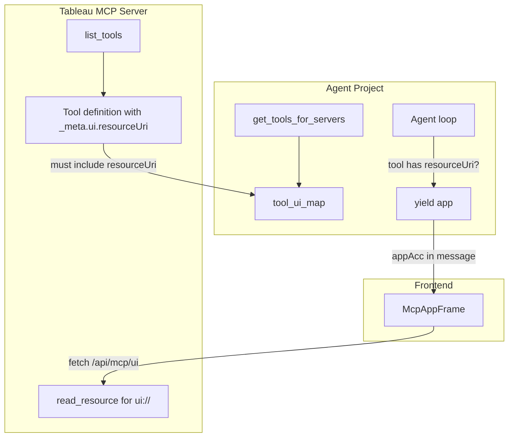

# MCP Apps Diagnosis: Why Visualizations Don't Appear

## Symptom

The agent responds with:

> I cannot directly create visualizations such as bar charts. My capabilities are limited to querying and presenting data in text or tabular formats. However, you can easily create a bar chart using the data I provided... copy the table into Excel or Google Sheets...

## Root Cause Analysis

MCP Apps support exists in the agent-project but requires **two conditions** to show visualizations:

1. **Tableau MCP server** must return `_meta.ui.resourceUri` in tool definitions
2. **Agent** must yield `"app"` when those tools are called

The visualization flow:



### Condition 1: Tableau MCP Server Must Support MCP Apps

The agent populates `tool_ui_map` only when tools include `_meta.ui.resourceUri`:

```python
# agent/tools.py
def _get_ui_resource_uri(mcp_tool: dict) -> str | None:
    meta = mcp_tool.get("meta") or mcp_tool.get("_meta") or {}
    ui = meta.get("ui") if isinstance(meta.get("ui"), dict) else None
    if ui and isinstance(ui.get("resourceUri"), str):
        return ui["resourceUri"]
    # ...
```

If the Tableau MCP server's `list_tools` response does **not** include `_meta.ui.resourceUri` for `query-datasource` or `get-view-data`, then `tool_ui_map` is empty and the agent **never** yields `"app"`.

**Check:** Inspect the Tableau MCP server's tool definitions. Do `query-datasource` and `get-view-data` include something like:

```json
{
  "name": "query-datasource",
  "description": "...",
  "_meta": {
    "ui": {
      "resourceUri": "ui://tableau-mcp/chart"
    }
  }
}
```

If not, the Tableau MCP server has not implemented MCP Apps. See [MCP_APPS_REQUIREMENTS.md](./MCP_APPS_REQUIREMENTS.md) for the spec.

### Condition 2: System Prompt Doesn't Inform the LLM

The system prompt ([agent/prompts.py](../agent/prompts.py)) does not tell the LLM that:

- When it calls `query-datasource` or `get-view-data`, an interactive chart may be rendered in the chat
- It should prefer these tools when the user asks for charts or visualizations
- It should **not** say "I cannot create visualizations" when these tools are available

The LLM falls back to its training ("I can only do text/tables") instead of recognizing that the tool ecosystem can produce charts.

---

## Areas to Address

### 1. System Prompt (Agent Project – Immediate Fix)

**File:** `agent/prompts.py`

Add instructions so the LLM knows about chart/visualization capability:

- When the user asks for a chart, bar chart, visualization, or graph, use `query-datasource` or `get-view-data` to fetch the data
- The chat app will render an interactive chart when the tool supports it
- Do not say "I cannot create visualizations" or suggest Excel/Sheets when these tools are available

This fixes the **LLM messaging** even when the Tableau MCP server does not yet support MCP Apps (the LLM will still call the tools and return tables; once the server adds MCP Apps, charts will appear automatically).

### 2. Tableau MCP Server (External – Required for Charts)

**Owner:** Tableau MCP server maintainers

The Tableau MCP server must:

1. Add `_meta.ui.resourceUri` to `query-datasource` and `get-view-data` tool definitions
2. Implement `read_resource` to serve HTML/JS at that `ui://` URI
3. The UI should accept tool result data and render an interactive chart (bar, line, pie, etc.)

See [MCP_APPS_REQUIREMENTS.md](./MCP_APPS_REQUIREMENTS.md) for full requirements.

### 3. Diagnostics (Agent Project – Optional)

Add logging when tools are fetched to verify whether `tool_ui_map` has entries:

```python
# In get_tools_for_servers or loop startup
if tool_ui_map:
    logger.info("MCP Apps enabled for tools: %s", list(tool_ui_map))
else:
    logger.info("No MCP Apps (resourceUri) in tool definitions; charts will not render")
```

This helps users confirm whether their Tableau MCP server supports MCP Apps.

### 4. Fallback Chart UI (Agent Project – Optional Enhancement)

As a workaround when the Tableau MCP server does not provide `resourceUri`, the agent-project could:

- Detect when `query-datasource` or `get-view-data` returns tabular JSON
- Render a simple client-side chart (e.g. via a lightweight chart library) from that data
- Show this when `tool_ui_map` is empty but the tool result is parseable tabular data

This would provide charts even before the Tableau MCP server implements MCP Apps.

---

## Summary

| Area | Owner | Action |
|------|-------|--------|
| System prompt | Agent project | Add instructions about chart capability and avoid "I cannot create visualizations" |
| Tool definitions | Tableau MCP server | Add `_meta.ui.resourceUri` for query-datasource, get-view-data |
| UI resources | Tableau MCP server | Implement read_resource for ui:// URIs with chart UI |
| Diagnostics | Agent project | Optional: log tool_ui_map on startup |
| Fallback chart | Agent project | Optional: client-side chart from tabular tool results |
