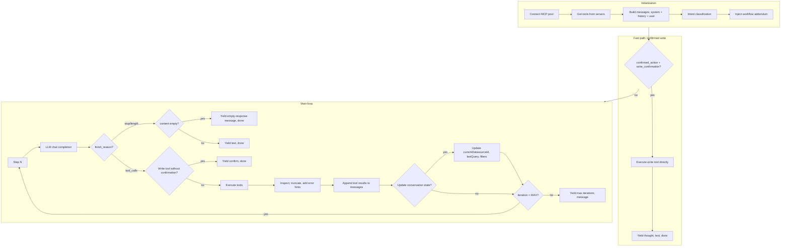

# Agent Reasoning Loop

This document explains how the Tableau agent's reasoning loop works: the ReAct pattern, iteration flow, chunk types, and special paths.

## Overview

- **ReAct-style loop:** Reason (LLM) → Act (tools) → Observe (results) → repeat
- **Entry points:** `run_agent_loop_stream` (streaming, used by API) and `run_agent_loop` (wrapper that consumes the stream and returns a tuple for eval and `/ask/sync`)
- **Source:** [agent/loop.py](../agent/loop.py)
- **Tools:** See [agent/tools.py](../agent/tools.py) `REQUIRED_TOOLS` for the full list (search-content, list-datasources, list-workbooks, list-views, get-workbook, get-datasource-metadata, query-datasource, get-view-data, download-*, inspect-*-file, publish-*, list-projects, list-flows).

## High-Level Flow

## Iteration Details

- **MAX_AGENT_ITERATIONS** (default 10) caps the loop
- Each iteration:
  1. Yield `"thought", "Step N:"`
  2. Call `client.chat.completions.create` with `tools`, `tool_choice="auto"`
  3. Stream chunks: `reasoning_content`/`thought` → thought; `content` → text; `tool_calls` → buffer
  4. If `finish_reason` in ("stop", "length"): yield text (if any), done, return
  5. If no tool_calls: yield text, done, return
  6. For each tool call: if WRITE_TOOLS and no `write_confirmation` → yield confirm, done, return
  7. Execute tools (built-in `execute_python` or MCP `call_tool`)
  8. Append assistant + tool messages; yield thought summaries, download, app as needed
  9. Loop continues (next iteration sees updated messages)

**Thought stream order:** (1) `"Step N:"`; (2) LLM reasoning chunks (if streamed); (3) for each tool: `"Using tool: {name}"` then multi-line input preview (query, code, viewId) if available; (4) after execution: `"  → {name}: {summary}"`

**Edge cases:** When the LLM returns `finish_reason` stop/length with empty content, or no tool_calls with empty content, the loop yields `"The model returned no response. Try switching to OpenAI—some providers do not support tool calling."`

## Chunk Types (Streaming Output)

| Type       | When                                                      | Data                                                    |
| ---------- | --------------------------------------------------------- | ------------------------------------------------------- |
| `thought`  | Step markers, LLM reasoning, tool usage, result summaries | string                                                  |
| `text`     | Final answer, errors, publish success/failure              | string                                                  |
| `app`      | Chart/visualization (MCP app)                              | `{resourceUri, toolName, toolCallId, result, serverId}`  |
| `download` | File from download-workbook/datasource/flow                | `{filename, contentBase64}`                             |
| `confirm`  | Write action needs user confirmation                       | `{action, correlationId}`                               |
| `done`     | End of run                                                 | `{sources, tool_calls, awaitingConfirmation?, conversationState?, trace?}` |

## Special Paths

**Confirmed action (fast path):** When the user has already confirmed a write (publish-workbook, publish-datasource, publish-flow), the loop skips the LLM and executes the tool directly. Used for "confirm once/session/forever" flow.

**Write confirmation:** Before executing WRITE_TOOLS, the loop checks `write_confirmation`. If absent, it yields `confirm` and returns. The frontend sends `confirmedAction` on the next request. The confirm chunk's `action.arguments` can include `projectPath` and `projectName` when resolved via MCP; the UI displays `projectPath ?? projectName ?? projectId` for disambiguation.

**Publish-specific behavior:** When the publish tool returns empty or `{}`, the loop yields `"Publish returned no confirmation. Check Tableau Server to verify."` When the error indicates `contentBase64`/`uploadSessionId` required, it yields `"Publish failed: A file is required. Attach a .twbx workbook (or .tdsx/.tflx) before publishing."`

**Built-in vs MCP tools:** `execute_python` runs in-process via [agent/python_exec.py](../agent/python_exec.py); all other tools go through MCP `call_tool`. The loop stores full (untruncated) results in `query_data_cache` keyed by datasource/view ID. When `execute_python` is called with empty or placeholder data, it injects the cached result; if the agent passed actual list data, injection is skipped to preserve multi-dataset analysis.

**Chart rendering:** Only `query-datasource` and `get-view-data` can yield `app` chunks. Requires `_user_wants_chart(question)` and `_result_has_chart_data(result, tool_name)` (non-empty rows). `tool_ui_map[name]` = `{resourceUri, serverId}` from MCP tool meta `ui.resourceUri`; `get_tools_for_servers` returns `(tools, tool_ui_map, tool_server_map)`.

## Message Format

- **System:** Built from core + workflow addendum via [agent/prompts.py](../agent/prompts.py) `get_system_prompt(question)` (intent-based injection)
- **User:** `[Context: ...]` (if conversation state) + `[Tableau is connected.] {question}` + attachment hints if present
- **Attachments:** User attaches files via the + button; agent receives `[Attached file(s) for publishing: ...]` hint. Publish tools use `contentBase64: 'ATTACHMENT_0'`, `'ATTACHMENT_1'`, etc. `_inject_attachments_in_args` replaces placeholders with actual base64 before MCP call.
- **Assistant/tool:** OpenAI function-calling format (`tool_calls`, `tool` role). Tool results are truncated to `MAX_RESULT_CHARS` and may include error hints.

## Intent and Prompt Routing

- **Intent classifier:** [agent/intent.py](../agent/intent.py) `classify_multi(question)` returns a list of intents (e.g. `["download", "query"]`). Multi-intent injection: when a question matches multiple workflows, all relevant addenda are injected.
- **Fallback:** If no intent matches, `general` (query addendum) is used.
- **Workflow addenda:** [agent/prompt_fragments.py](../agent/prompt_fragments.py) — injected based on intent(s).

## Conversation State

- **State object:** `{ currentDatasourceId, lastQuery, establishedFilters, lastDownloadedObjects?, targetProjectId?, targetProjectName?, lastInspectedObjectId?, lastInspectedObjectType? }` — updated per workflow (query, download, inspect, publish)
- **Injection:** Context block prepended to user message when state exists
- **Persistence:** Frontend passes state per thread; done chunk returns updated state

## Observability

- **Trace ID:** Optional `traceId` in request; logged at start and completion
- **Logging:** Workflow type, tool sequence, iteration count on completion or max-iterations

## Error Classification

Tool errors are classified and hints are appended to the truncated result before the LLM sees it:

| Error Pattern | Class | Hint Injected |
|---------------|-------|---------------|
| "401", "unauthorized", "403", "forbidden" | auth | "Check authentication; user may need to reconnect in Settings." |
| "404", "not found" | not_found | "Verify the resource ID or name exists." |
| "field" + "not found"/"unknown" | validation_field | "Re-check get-datasource-metadata for correct fieldCaption." |
| "rate limit", "429" | rate_limit | "Wait and retry, or simplify the request." |
| "connection", "timeout", "refused" | connection | "MCP server may be down; check Settings." |
| (default) | unknown | (none) |

## Chart Heuristic

`_user_wants_chart(question)` returns True if the question contains any of: `chart`, `charts`, `visualization`, `visualize`, `graph`, `graphs`, `bar chart`, `pie chart`, `line chart`, `plot`, `visual`, `show as chart`, `show as graph`, `display as chart`, `display as graph`. Only then can `query-datasource` or `get-view-data` yield `app` chunks (and only when `_result_has_chart_data` is true).

## Single Implementation

There is one implementation: `run_agent_loop_stream`. The `run_agent_loop` function is a thin wrapper that consumes the stream and returns `(answer, sources, tool_calls, awaitingConfirmation, conversationState, trace)`. This ensures:

- **Evaluation runs** exercise the same production code path (download handling, chart detection, publish result interpretation, graceful max-iterations summary).
- **Trace support** is integrated into the streaming path; when `_trace=True`, the done chunk includes `trace` (serialized via `LoopTrace.to_dict()`).

## Key Constants and Helpers

- **Environment:** `MAX_RESULT_CHARS` (default 50000) — truncation for LLM context; `MAX_AGENT_ITERATIONS` (default 10); `STREAM_READ_TIMEOUT` (default 300) — LLM stream read timeout
- `WRITE_TOOLS`, `DOWNLOAD_TOOLS`, `_CHART_TOOLS` from [agent/tools.py](../agent/tools.py) and loop
- `MAX_RESULT_CHARS`, `_truncate_for_llm`, `_classify_error`, `_error_hint` for result handling
- `_resolve_project_path`: recursively builds hierarchical project path (e.g. "Sales / Finance") via get-project or list-projects for confirmation UI
- `_resolve_project_name`: resolves projectId to name when path is unavailable
- `_inject_attachments_in_args`: replaces `ATTACHMENT_N` with base64 content
